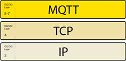
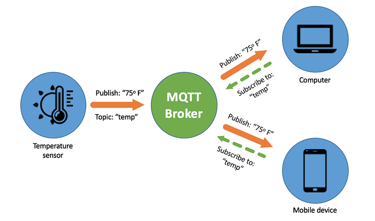
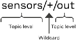
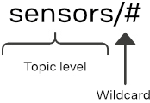
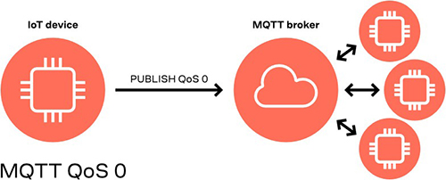
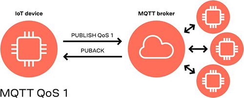
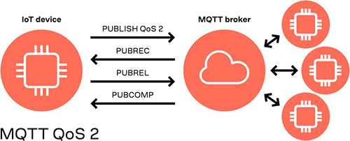

# Message Queuing Telemetry Transport (MQTT)

## MQTT Protocol

MQTT is a lightweight, publish-subscribe network protocol that transports messages between devices.

     

## MQTT Broker

The MQTT broker handles authentication of Things on the network as well as managing connections, sessions, and subscriptions.

Its main responsibility is to receive all published messages and then send them subscribed clients.

The MQTT broker also queues messages for subscribed clients, delivering them according to the agreed QoS level.

## MQTT Client

Any Thing (from a microcontroller to a massive server) that runs an MQTT library and connects to a broker over a network is an MQTT client.

Clients don’t send messages directly to and from each other but instead communicate to topics managed by the MQTT broker.

Clients can publish and subscribe to topics. The broker then receives and delivers messages to subscribed clients.

## MQTT Topic

Topics are made up of one or more topic levels, separated by a forward slash.

Example: sensor/temperature, sensor/moisture

Topics are case sensitive and don’t have to be pre-registered at the broker.

## Subscriptions

MQTT clients don’t connect directly to each other, instead, they subscribe to topics to receive messages.

To subscribe to a topic, the client must first send a SUBSCRIBE request to the broker.

The broker responds to the SUBSCRIBE request with a SUBACK (subscription acknowledged) response.

Subscriptions also have a QoS setting which can be used to downgrade the QoS of the published message.

### Subscription Wildcards

Subscriptions can use one of two types of wildcard (+ and #).

#### Single-level (+)

This wildcard would cover the following topics:

sensors/soil/out, sensors/water/out and sensors/light/out

#### Multi-level (#)

This wildcard would cover the following topics:

sensors/soil/out, sensors/soil/in and sensors/temperature/out

## MQTT QoS (Quality of Service)

MQTT supports multiple levels of QoS for guaranteeing message delivery.

### QoS 0: At most once

QoS 0 (zero) is used to ensure that a message reaches its destination no more than once.

QoS-0 key features:

    1. Best effort message delivery
    2. No acknowledgment from the recipient
    3. Not retried by the sender
    4. Not queued by the broker for disconnected clients with a valid subscription to the topic

### QoS 1: At least once

QoS 1 is used when message delivery is critical. This is achieved by queueing messages until the subscriber is able to receive it.

QoS-1 key features:

    1. Guarantees that a message is delivered at least one time to the recipient.
    2. Sender stores the message until it receives a PUBACK from the recipient.
    3. Messages may be sent or delivered multiple times.

### QoS 2: Exactly once

QoS 2 is used when the message needs to arrive once and only once.

QoS-2 key features:

    1. QoS 2 is the safest and slowest Quality of Service level.
    2. Guarantees that each message is received only once by the intended recipients
    3. Uses at least two request/response flows (a four-part handshake) between the sender and the receiver.

### [Reference](https://www.u-blox.com/en/blogs/insights/mqtt-beginners-guide)
